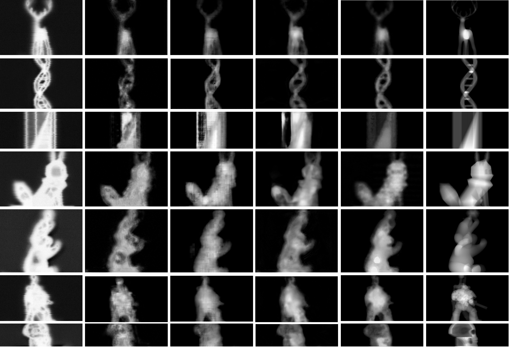

<!-- # Seeing through a Black Box: TowardHigh-Quality Terahertz Imaging via Subspace-and-Attention Guided Restoration -->
## The 3D Tomography Results for 7 Objects

# Box

# Deer

# DNA

# Eevee

# Bear

# Robot

# Skull

## Image Restoration Experiments

Qualitative comparison of THz image restoration results for seven objects from left to right: (a) Time-max, (b) DnCNN-S, (c) RED, (d) NBNet,
(e) U-Netbase, (f) U-NetMS, (g) SARNet, and (h) the ground-truth.
